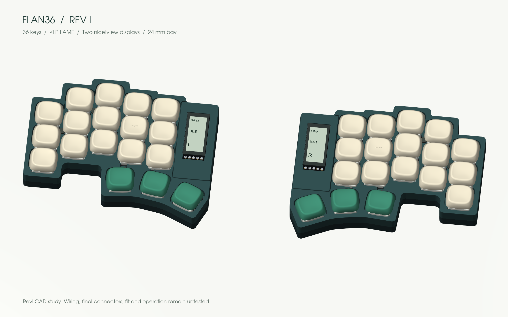

# Flan36

**36 keys. Piantor angles. Your keycaps, your frames.**

**[Explore and customize in 3D →](https://eduarbo.github.io/flan36/)** · **[Parts and buying links →](docs/parts.md)** · **[Edit in FreeCAD →](docs/freecad.md)**

*RevI: key-aligned local curves, four interchangeable cases, optional exposed display stack, magnetic frames and a floor-mounted cell in either battery size. Physical fit untested.*

**[Themes and print kits](docs/themes-printing.md)** — Sixteen coordinated themes, personal keycap palettes, linked rim/frame colors and selected STL/3MF parts.

**[Lower, level stack](docs/level-stack.md)** — Glass, frame and removable switch-covering shell share a 13.39 mm plane. Connector fit remains unqualified.

**[Case variants](docs/cases.md)** — Level, Solid, Color rim and Terrace; actual meshes in the explorer.

Flan36 is a low-profile wireless split keyboard in development by [Eduardo Ruiz](https://github.com/eduarbo). It keeps Piantor’s key centers and angles, with five columns and three thumb keys per half.

- **KLP Lamé choices:** all 38 Choc-stem variants catalogued; 28 qualify in at least one position. The viewer checks complete combinations and exports a configuration for FreeCAD.
- **Magnetic frames:** Cartridge, Arcade, Mecha, Kintsugi, Handheld, Retro TV and Cyberpunk, with flush multicolor inlays, plus three plain styles. Match the frame to the case rim or give each half its own palette.
- **Keycap colors:** paint all keys, rows, columns or individual keys; save and share your own palettes.
- **Free tools:** KiCad for electronics, FreeCAD for the case, StepUp for exchange. Editable source, STEP/STL, offline viewer and GLB included.
- **Intended hardware:** Choc v1 hot-swap, two nice!nano controllers and two nice!view displays. One display remains the fallback.

**Status: digital prototype, not ready to manufacture.** Both PCB studies have zero geometric DRC violations and 104 unconnected items each. Routing, exact connectors, printed retention, BLE and power consumption still require work. The visual model does not establish hardware compatibility.

**[Keycaps and frames](docs/customize.md) · [Design](docs/design.md) · [Build](docs/build.md) · [CAD files](docs/cad.md) · [Progress](docs/progress.md)**

Based on [Piantor by beekeeb](https://github.com/beekeeb/piantor), with [KLP Lamé by braindefender](https://github.com/braindefender/KLP-Lame-Keycaps). [Credits and licenses](ATTRIBUTION.md). [Contributing](CONTRIBUTING.md).
