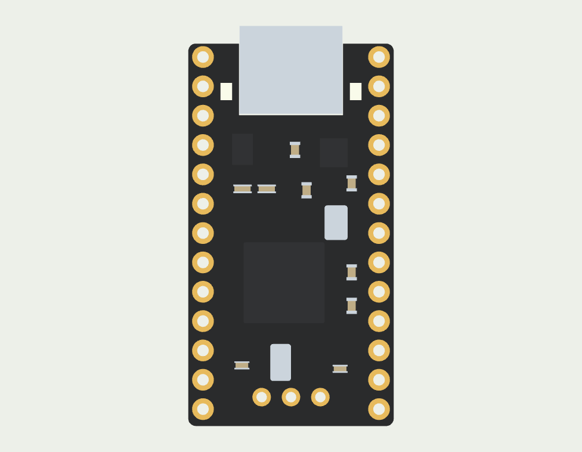

# Component models

These models make the assembly easier to inspect. They are **nominal representations**, not a claim of measured fit or manufacturer CAD.

| Part | Geometry and appearance | Evidence / remaining limit |
| --- | --- | --- |
| nice!nano v2 | Black rounded PCB, ENIG contacts, mid-mount USB-C shell and tongue, separate ICs, crystals, passives and LEDs | Official identity, 3.2 mm overall thickness and mid-mount USB. PCB 17.78 × 33.1 mm and total length 34.624 mm use a community drawing. Individual package placement/heights are reconstructed from photographs. |
| nice!view | 14 × 36 × 2.9 mm stack, five contacts, glass and backing; 10.744 × 25.28 mm active image | Official module drawing and Sharp panel specification. Preserve the 14.2 × 36.2 mm V-cut reserve for fit. Glass/flex assembly positions remain nominal. |
| Choc v1 | KiSwitch housing, pins and moving stem; original geometry, recolored | Generic Choc v1 community CAD; not a measured Pro Red specimen. KLP insertion and travel are not physically verified. |
| 36 SOD-123 diodes | Pinned KiCad source geometry, 18 per underside at the actual footprint poses | Nominal package dimensions; solder thickness remains unmeasured. |
| PCM12 / TL3342 | KiCad STEP geometry and original face materials | Registered to the existing KiCad footprints. Library models, not toleranced manufacturer assemblies. |
| Choc hotswap socket | 36 pinned KiSwitch sockets, registered to the actual footprint bores and solder-contact planes | Nominal bottom Z1.95 mm, 0.55 mm above the floor. The relieved internal H3 support has a measured K30 gap of 0.2500001 mm on both halves; minimum material around its pilot is 1.336281 mm left / 1.247739 mm right. [Clearance evidence](../validation/revI-socket-clearance.json). Actual KiCad STEP registration and native collisions are checked. Purchased variant, solder thickness and physical fit remain unqualified. |
| Batteries, MCU sockets and leads | Nominal cell profiles, socket reserves and continuous lead routes | Finished pouch seams, contacts, solder, wire diameter, terminations and strain relief still require measurement. |
| JST PH connector | Dimensioned side-entry header and mated housing envelope | Original reconstruction from the public catalog; internal mating and supplied plug dimensions are unmeasured. |

The right half uses the **same** commercial nano/display geometry, translated into place. The power switch is rotated to its footprint. Neither module is mirrored.

FreeCAD, the web viewer and the revI KiCad relative STEP models share this nominal geometry. The STEP export is reimported and compared with the native solids at each existing footprint datum; relative model references are preserved. The slim update changes J1 and moves the reset to the underside; actual KiCad STEP exports verify the resulting registration. [Readback](../validation/revI-pcb-component-models.json).

The controller support has scalloped upper ledges. These keep clear of a 1.05 mm radius reserve around the underside pads. They do not establish solder tolerance or retention force.

The lowest modeled nice!view PCB sits 6.09 mm above the main PCB using a nominal Samtec SLW/TLW pair. The row follows the official 1.3 mm end offset. Commercial finished-hole/post fit, actual mating and solder tolerances remain unqualified. The stock 7 mm pair belongs to the preceding taller reference. [Stack dimensions and limits](../docs/level-stack.md).

## Sources

- [nice!nano product specifications](https://nicekeyboards.com/nice-nano/) and [official v2 pinout, both faces](https://nicekeyboards.com/docs/nice-nano/pinout-schematic/).
- [Jordan Banasik / Woovie nominal v2 drawing](https://github.com/Woovie/nicenano-v2-model/tree/88099bcecdf2b60a0ec73131b132a182da03302b), CC0. Used as a dimensional reference; no recolored Pro Micro model is used.
- [nice!view mechanical drawing](https://nicekeyboards.com/docs/nice-view/pinout-schematic/) and [Sharp LS011B7DH03 catalogue](https://global.sharp/products/device/catalog/pdf/sharp_device202109_e.pdf).
- [KiSwitch source revision](https://github.com/kiswitch/kiswitch/tree/aefcf65038d48d2666ff14530d482be3c350fa6e), under its [MIT option](sources/KiSwitch-MIT.txt).
- [KiCad library license and exception](https://www.kicad.org/libraries/license/). Imported STEP files are CC-BY-SA-4.0 with the library exception. Original colors are preserved; only placement changes.

Exact asset URLs, hashes and licenses: [sources.json](sources.json). Official photographs are references, not images relicensed by this project. Parametric reconstruction: [components.py](../tools/freecad/components.py).

### PH battery connector

The slim stack uses an original nominal reconstruction of a **JST S2B-PH-K-S**
side-entry header and **PHR-2** housing. The public [JST PH catalog](https://www.jst-mfg.com/product/pdf/eng/ePH.pdf)
gives the side-entry mated assembly reserve as **9.6 mm long × 4.8 mm high**, with
2 mm pin pitch. The header body is 5.9 × 7.6 × 4.8 mm and the housing is
5.8 × 6.85 × 4.5 mm. Internal engagement, wire-port positions, plastic tolerances
and the purchased battery polarity remain unmeasured. No downloaded JST CAD is
redistributed. See `tools/freecad/slim_stack.py` and the bundled original footprint.
