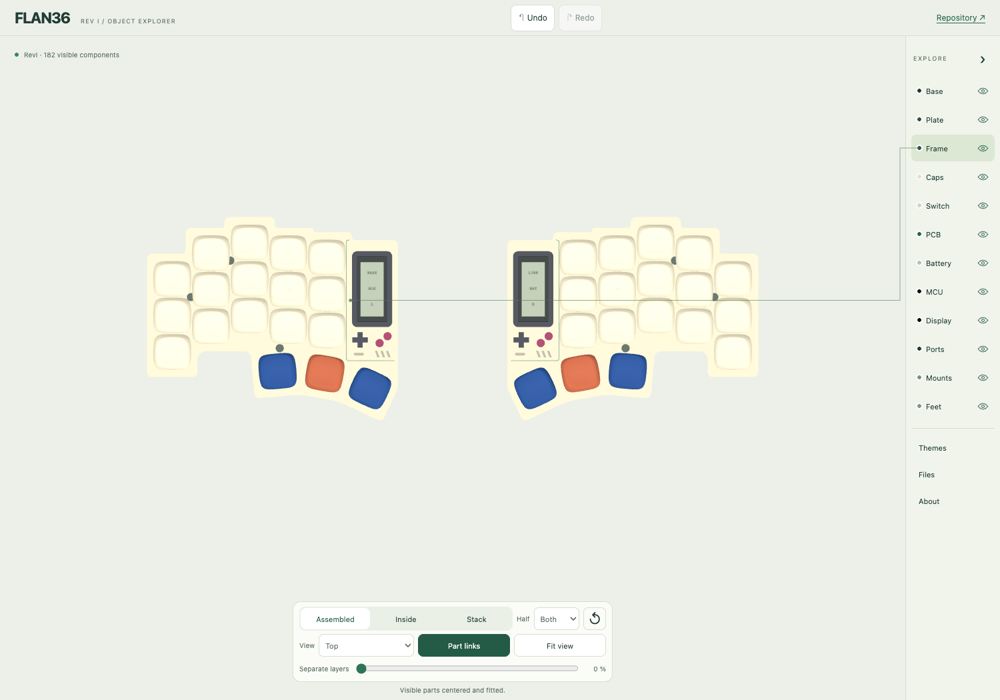

# Frame artwork orientation

Request: `user:20260929:no-invertir-frames-derechos`.

Both halves must show each installed frame design in the same reading direction.
The right-hand shell, corner radii, window, underside, magnets and mounting geometry
retain their existing handedness. Colors, height, keycaps and the rest of the
assembly remain unchanged.

The correction translates left artwork by −86 mm on X into the right bay. It does
not reflect the artwork or move the shell. The native document records this policy
so earlier documents without the marker still reproduce their original geometry.

Acceptance covers the saved/reopened native source, exact material regions,
STL/STEP exports, the online/offline viewer and its downloaded print kit. Asymmetric
Game Boy and SNES features must match by translation and reject the former mirrored
arrangement. Hanafuda remains pending integration; retired shapes stay excluded.



[Digital acceptance](../validation/revI-frame-orientation.json) includes the
reopened native comparison, unchanged parts, exact material exports and a real
viewer download. Physical fit qualification remains separate.

## Reproduce

Use the source from commit `4b59c1d8cfae7248a2109666ec81350c4c3b0f0c`
in a separate directory. The installer refuses to overwrite an existing candidate.

```sh
mkdir -p build/frame-orientation/source
git show 4b59c1d8cfae7248a2109666ec81350c4c3b0f0c:mechanical/revI/Flan36.FCStd > build/frame-orientation/source/Flan36.FCStd
python3 tools/freecad/run_macos.py tools/freecad/install_frame_orientation.py \
  --source build/frame-orientation/source/Flan36.FCStd \
  --output build/frame-orientation/candidate/Flan36.FCStd
FLAN36_EXPORT_OUT=build/frame-orientation/candidate \
FLAN36_EXPORT_METADATA=build/frame-orientation/candidate/revI.json \
FLAN36_EXPORT_REPORT=build/frame-orientation/candidate/mechanical.json \
python3 tools/freecad/run_macos.py tools/freecad/export_revI.py
python3 tools/adopt_frame_orientation.py build/frame-orientation/candidate
```

Once the accepted candidate and its attributable exports are adopted:

```sh
python tools/build_viewer_revI.py
node viewer/build.mjs
node viewer/finishes-check.cjs
node viewer/frame-collection-check.cjs
node viewer/frame-orientation-check.cjs
```

Browser checks use Playwright and Chromium as described in the CAD guide.
Set `FLAN36_VIEWER_URL` on the orientation check for public readback. The ignored
`build/frame-orientation/` CAD candidates, exports, screenshots and downloaded
print/GLB samples are reproducible with these commands. Historical CAD and STEP
archive metadata may differ; compare actual geometry and recorded mesh hashes.
