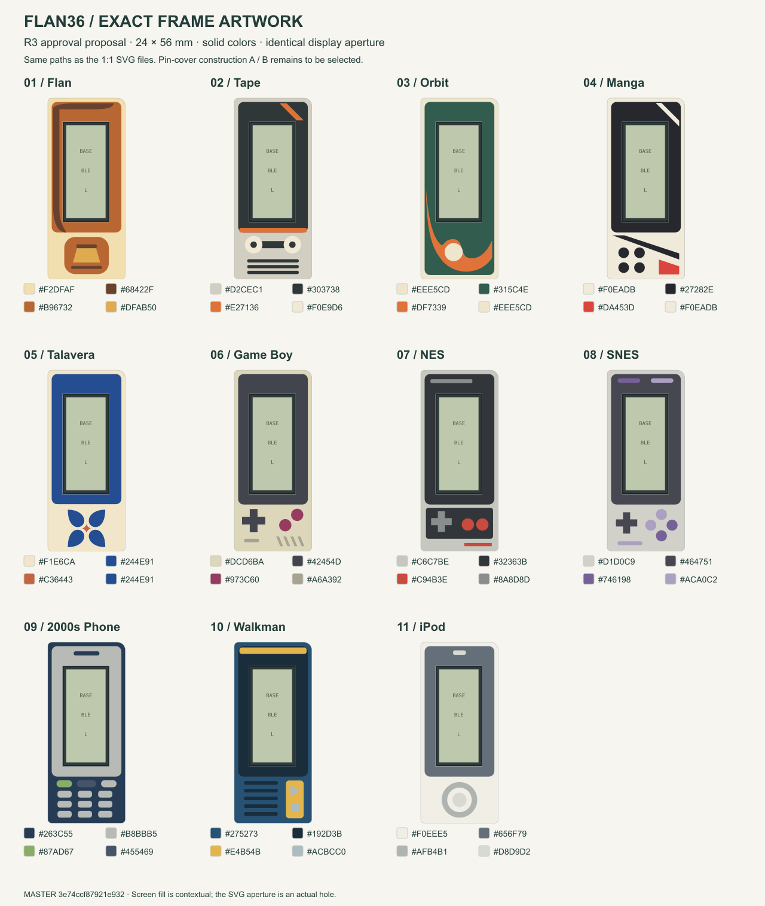
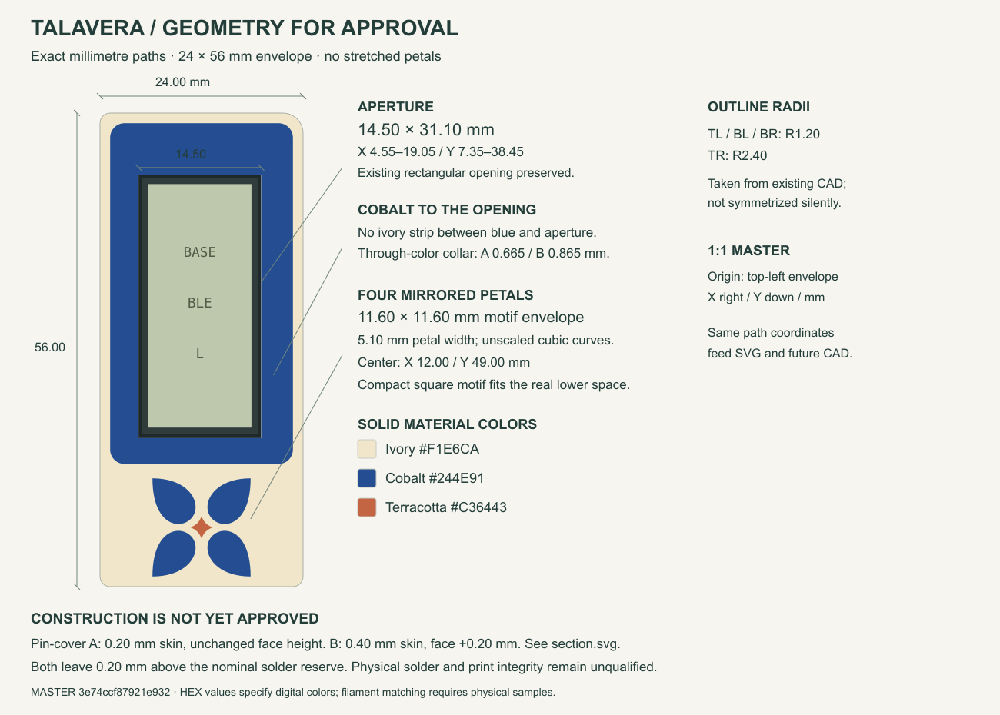
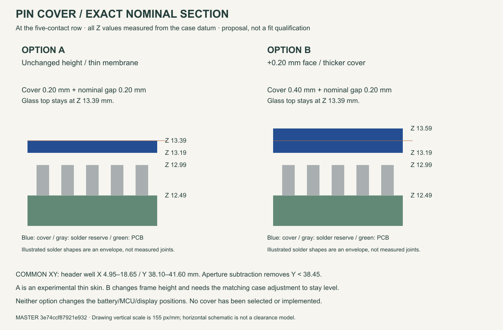

# Frame artwork R3 — approval proposal

Superseded by [R4](../frame-master-r4/README.md). Historical correction: R3's mirror check covered the merged envelope and area, not individual decorative roles. R4 verifies each reflected color partition against independently transformed paths. The original R3 artifacts and receipt are retained below.

These are dimensioned vector designs, not generated concept renders. **Proposed, not approved.** Production CAD, PCB, frame recipes and viewer remain unchanged.



## Files

- [Editable FreeCAD artwork](Artwork-R3.FCStd): 44 planar color regions in eleven groups. These are **2D faces, not printable frame solids**. Open in FreeCAD, choose **Top view**, then **Fit all**. Select a group or hide the others with Space. Group placements only arrange the review sheet; each part's local geometry is 24 × 56 mm.
- [Exact master](master.json): millimetre paths, Bézier control points, corner radii, color assignments, color priority and construction alternatives.
- [Talavera drawing](talavera-dimensioned.svg) and [pin-cover sections](section.svg).
- Other dimensioned sheets: [Flan](flan-dimensioned.svg), [Tape](tape-dimensioned.svg), [Orbit](orbit-dimensioned.svg), [Manga](manga-dimensioned.svg), [Game Boy](gameboy-dimensioned.svg), [NES](nes-dimensioned.svg), [SNES](snes-dimensioned.svg), [2000s Phone](phone-dimensioned.svg), [Walkman](walkman-dimensioned.svg), [iPod](ipod-dimensioned.svg). Each includes a feature-by-feature bounds table; exact curves remain in the master.
- Individual 1:1 SVGs: [Flan](flan.svg), [Tape](tape.svg), [Orbit](orbit.svg), [Manga](manga.svg), [Talavera](talavera.svg), [Game Boy](gameboy.svg), [NES](nes.svg), [SNES](snes.svg), [2000s Phone](phone.svg), [Walkman](walkman.svg), [iPod](ipod.svg).
- [Geometry check](geometry-check.json): native source readback, exact SVG paths/colors, feature bounds, disjoint color regions, complete face coverage and saved/reopened FreeCAD checks.

Print SVGs at **100% / actual size**, with no fit-to-page scaling. On-screen millimetres depend on the display; the SVG document units are millimetres.

## Geometry and color

Every design uses the existing **24 × 56 mm** frame perimeter and **14.50 × 31.10 mm** aperture. Local origin is the top-left envelope corner, X right and Y down. The actual existing outer radii are R1.20 at three corners and R2.40 at the upper-right; this proposal does not silently replace the outline.

The Talavera blue region ends exactly at the aperture. The narrow dark line in the contextual preview is the display and open clearance, not an ivory inlay. The 1:1 SVG has a real hole and no decorative screen fill.

The Talavera motif occupies an **11.60 × 11.60 mm square**, centered at **X12.00, Y49.00**. Its four mirrored cubic petals are not squashed to fill the frame width. This is the explicit, compact adaptation to the real lower space; the earlier concept image did not establish usable dimensions. Approve this actual geometry, not the earlier photograph's proportions.

Colors are solid **sRGB HEX** values. They are design targets, not claims of an exact physical filament match. All graphics are flush color regions; controls and motifs add no relief.



## Cover construction remains a separate choice

The current model puts the face and glass top at **Z13.39 mm**, the nominal solder reserve at **Z12.99 mm**, and the pin tips at **Z12.79 mm**. There is only **0.40 mm** above the solder reserve.

| Option | Cover thickness | Nominal solder clearance | Face height | Consequence |
|---|---:|---:|---:|---|
| A | 0.20 mm | 0.20 mm | 13.39 mm | Experimental thin membrane; frame height unchanged. |
| B | 0.40 mm | 0.20 mm | 13.59 mm | Face rises 0.20 mm; glass recesses 0.20 mm. Matching case height would also need approval. |

Neither option has been selected, printed or qualified on real solder joints. The drawings hide the pins **conditionally on one of these covers**. They do not claim that the current open service well is already covered. The cover is removed with the frame for service.

The proposal colors the PCB collar through its whole depth instead of cutting another recess into it. The master explicitly partitions the face into three disjoint XY domains: ordinary roof, PCB collar, and header cover. The current relief and ordinary roof undersides remain fixed in both options. **B raises the entire face and the matching case top**, not just the cover.

| Domain | Option A Z range | Option B Z range |
|---|---|---|
| Ordinary color inlay | 12.99–13.39 mm | 13.19–13.59 mm |
| Ordinary minimum backing | 0.80 mm | 1.00 mm |
| Through-color PCB collar | 12.725–13.39 mm (0.665 mm) | 12.725–13.59 mm (0.865 mm) |
| Through-color header cover | 13.19–13.39 mm | 13.19–13.59 mm |
| Matching case face | 13.39 mm | 13.59 mm |

These named exceptions must be implemented explicitly and verified after approval; the old support mask must not silently erase the design. Underlying frame walls and mounting datums remain as in the native baseline.



## Literal transfer after approval

1. Record the approved `master.json` SHA-256 and selected cover option. Approval of artwork alone does not approve a height or construction change.
2. Consume its closed M/L/A/C/Z paths directly, in millimetres. Apply the stated aperture subtraction and painter order. The supplied FreeCAD faces demonstrate this exact conversion.
3. Use those disjoint color regions for the approved roof construction. Preserve assembly datums, mounting interfaces and all unrelated components.
4. Compare actual CAD top-face regions against the approved regions. Maximum symmetric-difference area: **0.002 mm² per stable material role**, even when roles share a HEX value. Bound deviations: **0.01 mm**. Transform complete curves on the right half. No disappearing features, fit scaling, repositioning or support-mask clipping.
5. Check complete 3D intersections, minimum local thickness, bridge attachment and service removal. Then verify the exported files and actual viewer against the same approved digest.

If a constraint cannot preserve the approved design, stop that conversion and return a dimensioned change for approval. Do not improvise a different composition.

## Reproduce this proposal

From the repository root, with the existing FreeCAD installation and `rsvg-convert`:

```sh
python3 tools/prepare_frame_master.py
python3 tools/freecad/run_macos.py tools/freecad/prepare_frame_master.py
python3 tools/render_frame_master_dimensions.py
```

The native document is opened read-only for dimension checks and never saved. The proposal document contains no solids. Its archive hash can change on regeneration because FreeCAD stores document metadata; geometry, source digest and color checks establish reproducibility. `geometry-check.json` records the hash of the specific delivered file.
