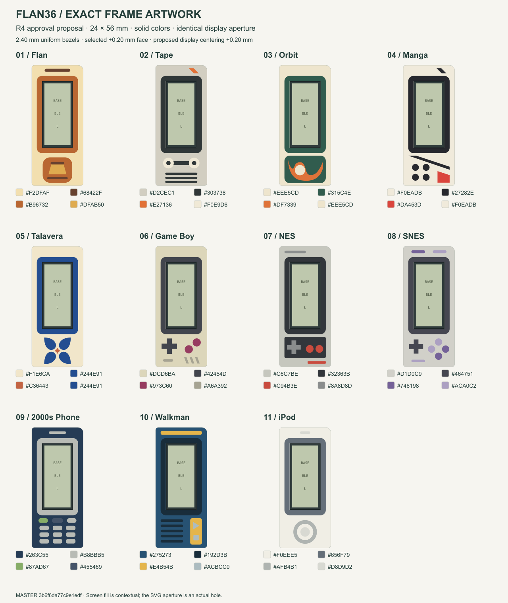
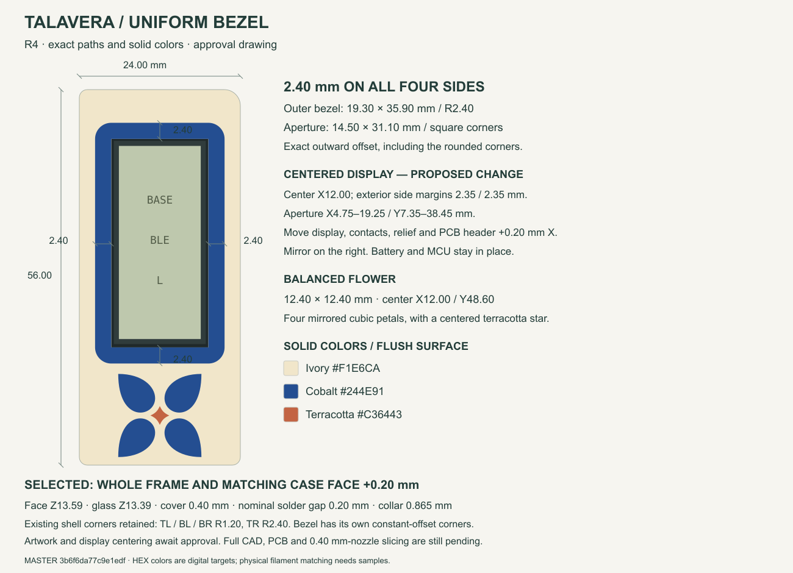
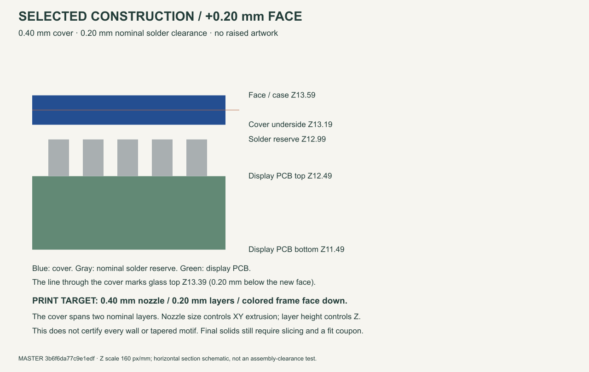

# Frame artwork R4

> Historical approval record. The contextual R4 drawings incorrectly filled the entire display opening dark, hiding 0.25 mm beyond the PCB on each side. Use the separate [seam correction](../display-seam-r1/) and [actual-geometry comparison](../display-seam-r1/comparison.png). The six rejected designs now have [R5 proposals](../frame-redesign-r5/). The original proposal text below is preserved as history.


**Revised approval drawings.** The +0.20 mm frame/case height is selected. Artwork and display centering await approval; production CAD, PCB and viewer are unchanged.



## What changed

- All eleven bezels are **2.40 mm wide**: the exact outward offset of the 14.50 × 31.10 mm aperture, including R2.40 outer corners. Decorative features cannot overlap this ring.
- The proposed screen center is **X12.00 mm**, giving **2.35 mm** exterior side margins. This requires moving the **whole display mating chain +0.20 mm X on the left, mirrored on the right**: module, glass, both contacts, relief, service well and PCB header footprint. The battery, MCU and mounting datums stay put. This is a visible proposal, not an already-verified hardware change.
- Talavera has a **12.40 × 12.40 mm** mirrored flower. The other designs use aligned panels, regular spacing, centered controls and separate headers. Nothing is scaled or clipped during transfer.
- Colors are solid sRGB HEX targets. All decoration is flush; no gradients or raised details. Physical filament colors require samples.

The old Talavera bezel was **3.35 / 3.75 / 6.15 / 3.05 mm** on left/right/top/bottom. Exact coordinates alone did not make its composition consistent. R4 adds an explicit equal-width and no-overlap check for every style.

The existing **24 × 56 mm mating envelope** remains: outer shell corners TL/BL/BR R1.20 and TR R2.40. These mechanical corners are distinct from the uniform decorative bezel. Making the shell corners identical would require a separate mating-geometry change; this proposal does not conceal that asymmetry.



## Selected height and 0.40 mm nozzle target

| Feature | Proposed value |
|---|---:|
| Whole frame and matching case top | Z13.59 mm (+0.20 mm) |
| Glass top | Z13.39 mm (0.20 mm recessed) |
| Pin cover | Z13.19–13.59 mm, 0.40 mm thick |
| Gap above nominal solder reserve | 0.20 mm |
| Ordinary face inlay | Z13.19–13.59 mm |
| Minimum ordinary backing | 1.00 mm |
| Through-color PCB collar | Z12.725–13.59 mm, 0.865 mm thick |

The target is a **0.40 mm nozzle and 0.20 mm layers**, with the colored frame face down. The cover then occupies two nominal layers. Nozzle diameter controls extrusion in XY; it is not the Z layer height or an exact wall-width rule. See [Prusa's nozzle-profile guidance](https://help.prusa3d.com/article/creating-profiles-for-different-nozzles_127540).

This height increase does **not** establish that every case wall, tapered motif, gap or support prints correctly. Full solids, 0.40 mm-nozzle slicing and a fit coupon remain required. The display translation also needs complete assembly collision checks and PCB route/DRC validation before release.



## Exact editable files

- [Master JSON](master.json): millimetre paths, colors, order, aperture, mechanical deltas and Z intervals. This is the transfer source.
- [FreeCAD artwork](Artwork-R4.FCStd): 43 planar color regions in eleven groups, **not printable solids**. Open in FreeCAD, choose Top view and Fit all. Hide other groups with Space. Local geometry is 24 × 56 mm; group placement only lays out the collection.
- [Geometry checks](geometry-check.json): native baseline readback, equal bezel widths/offset area, no decorative overlap, exact SVG paths/colors, disjoint planar regions, complete right-side curve reflection and saved/reopened faces.
- [Review receipt](review.json): scope, findings and remaining acceptance.

| Style | 1:1 SVG | Dimensioned drawing |
|---|---|---|
| Flan | [SVG](flan.svg) | [Drawing](flan-dimensioned.png) |
| Tape | [SVG](tape.svg) | [Drawing](tape-dimensioned.png) |
| Orbit | [SVG](orbit.svg) | [Drawing](orbit-dimensioned.png) |
| Manga | [SVG](manga.svg) | [Drawing](manga-dimensioned.png) |
| Talavera | [SVG](talavera.svg) | [Drawing](talavera-dimensioned.png) |
| Game Boy | [SVG](gameboy.svg) | [Drawing](gameboy-dimensioned.png) |
| NES | [SVG](nes.svg) | [Drawing](nes-dimensioned.png) |
| SNES | [SVG](snes.svg) | [Drawing](snes-dimensioned.png) |
| 2000s Phone | [SVG](phone.svg) | [Drawing](phone-dimensioned.png) |
| Walkman | [SVG](walkman.svg) | [Drawing](walkman-dimensioned.png) |
| iPod | [SVG](ipod.svg) | [Drawing](ipod-dimensioned.png) |

Print SVGs at 100% / actual size; screen millimetres depend on display scaling.

## Transfer after artwork approval

Freeze the approved master SHA-256. Consume its paths directly, subtract the aperture and resolve the stated color order. Extrude the three explicit face domains: ordinary roof, through-color collar and pin cover. Do not trace PNGs, scale motifs, alter colors or clip to the old support mask.

Verify the exported top-face color partitions against the approved master: symmetric difference below **0.002 mm² per stable role**, bounds within **0.01 mm**, no disappearing features and exact digest provenance. Then verify the entire assembly, PCB and print files. If geometry cannot preserve the approved design, return a dimensioned revision rather than silently modifying it.

## Reproduce

From the repository root, using the existing FreeCAD installation and `rsvg-convert`:

```sh
python3 tools/prepare_frame_master_r4.py
python3 tools/freecad/run_macos.py tools/freecad/prepare_frame_master.py --revision R4
python3 tools/render_frame_master_dimensions.py --revision R4
```

The native production file is read but never saved. FreeCAD archive metadata can change its binary hash on regeneration; geometry and color checks verify the regenerated content. R3 remains as historical evidence and is not regenerated by these commands.
