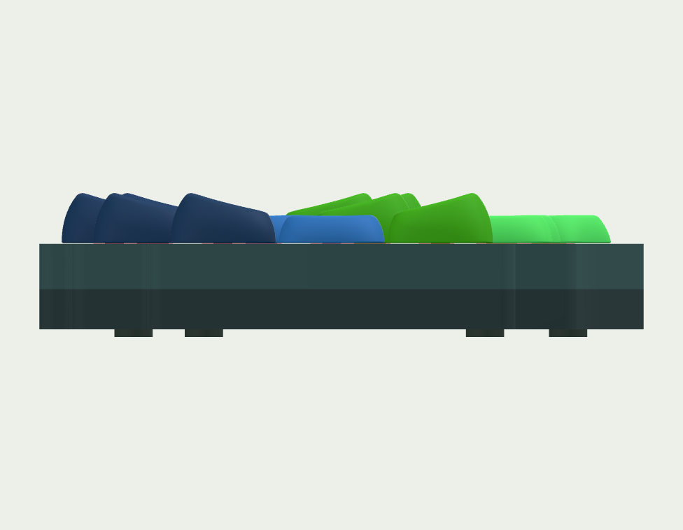
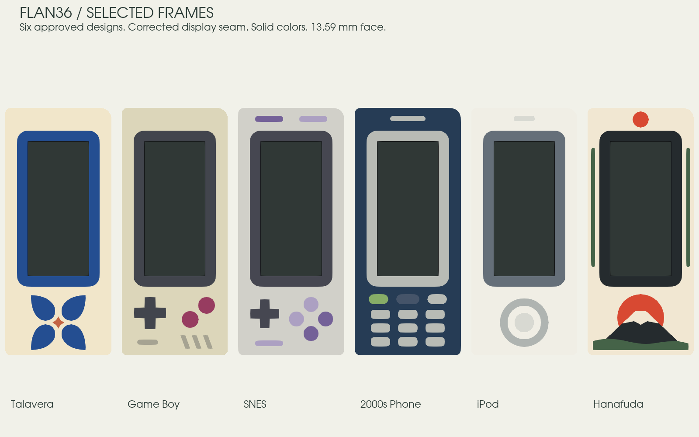
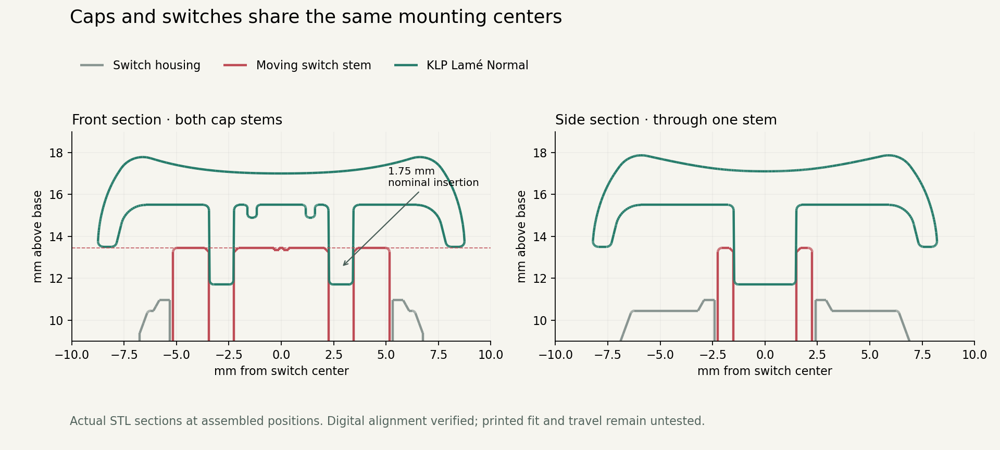

# Choose your keycaps and frames

Open the **[3D configurator](https://eduarbo.github.io/flan36/)**. No account or paid software is required.

## Keycap colors


Open **Caps → Colors**. Choose **Both / Left / Right**, then **All keys, Row, Column or Individual key**. Tap the key map to select a key or its group; pick a color to apply it immediately. Finger columns exclude thumbs. The **Thumbs** row colors all three thumb keys on the selected halves.

Eight keycap palettes provide starting points with coordinated thumb accents and a whole-row Sunset option. None gives the pinky column a separate color. They change key colors only. **My palettes** saves the exact colors of all 36 keys, with JSON import/export for sharing or another device. **Themes** applies a coordinated palette to the case, frame and keys. Changing keycap shape or rotation preserves its color.

Configuration JSON, GLB and the FreeCAD import/export macro retain individual key colors. STL has no color data: assign filament per key or paint in the slicer. The case/frame print kit does not include keycap toolpaths; use the unchanged KLP source meshes for those.

## KLP Lamé

Open **Caps** in the directory, then click a preset preview to apply a complete set. Open **Edit keys** to choose a row, all thumbs or one key. Select a variant and rotation, then **Apply to these keys**. Each change checks the complete configuration, including neighboring keycaps and the frame.

| Choc-stem family | Files | Qualified reference positions |
|---|---:|---|
| Choc-size 1U | 7 | All 36 keys, at 0° or 180° |
| Choc-size 1U, 90deg stems | 7 | Thumbs only, at 90° or 270° |
| MX-size 1U, standard stems | 7 | Thumbs only, at 0° or 180° |
| MX-size 1U, 90deg stems | 7 | Thumbs only, at 90° or 270° |
| Choc-size and MX-size 1.5U | 10 | None qualified with the reference neighbors |

The seven 1U profiles are **Normal, Normal Homing, Normal Tilted, Saddle, Saddle Homing, Saddle Tilted and Thumb**. Each size also includes 1.5U Normal, Saddle H/V and Thumb H/V.

**MX size describes the keycap body, not its stem.** Every file in this catalog has Choc stems. MX-stem files are incompatible with the selected switches and are excluded. A `90deg` file rotates the stems inside the cap; the whole cap must then rotate 90° or 270° to match the unchanged switch. Actual stem geometry, rather than the H/V filename alone, determines allowed orientation.

The full [catalog](../keycaps/catalog.json) includes all 38 files and their source hashes. Unsupported 1.5U files remain available for study, but the configurator does not enable them. Failed conservative qualification is not proof that every possible physical arrangement is impossible.

The check uses unchanged STL convex envelopes with **at least 0.20 mm XY clearance**. Clear envelopes remain separate throughout independent vertical motion. A **3.5 mm travel study** keeps the complete cap mesh at least 0.6 mm above the plate, using an illustrative common stem-tip height of 11.7 mm. This does **not** prove real seating, switch travel or printed stem fit. Tilted caps are seated from their stem tips, rather than given the same arbitrary mesh origin as flat caps.

For the lowest profile, start with the flat variants. At the common nominal seating datum, Choc-size Normal/Thumb tops reach **17.87 mm**, Saddle **17.78 mm**, and Tilted variants **21.34 mm**, before feet. Tilted caps therefore add about **3.5 mm** locally; their comfort and final seated height need a physical trial.

Presets: **Original**, **Sculpted Normal** and **Sculpted Saddle**. The sculpted presets place the high edges away from the home row: top row **180°**, bottom row **0°**, on both halves. Their previews show the actual three-row side profile at the shared stem seating datum. They are starting points for comfort trials, not an ergonomic prescription.

Older saved configurations keep their explicit rotations. In **Caps**, **Fix top/bottom slopes** turns only the reversed, unrotated-stem Tilted caps in the finger rows. Colors, custom cap variants, home keys, thumbs and other components stay as selected. Alternatively, select either corrected sculpted preset to replace the complete cap arrangement while retaining your colors. [Directional geometry and export checks](../validation/revI-cap-rows.json).



## Print a themed display frame



Open **Frame** in the directory, then choose Both halves, Left or Right, then click a theme thumbnail to apply it immediately. Each preview shows that actual mesh with its original palette. Switching shapes preserves customized colors. Use **Restore design colors** to apply the original palette. **Body** changes the shell color without changing the accent colors; **Restore design colors** restores the palette for the selected half or halves. You can also select the frame directly on the model to open its sidebar options for that half.

See the [six installed frame designs](frames-extra.md): Talavera, Game Boy, SNES, 2000s Phone, iPod and Hanafuda. All use solid colors, with Talavera as the default.

The controls are decorative. No logos, extra switches or LEDs are required. All six installed styles use the same window, cavity, three magnetic stations and independent display support. Each decorated design includes a closed shell plus complementary color volumes for co-printing. The assembled surface is flush and stays within the 24 mm bay. A fused single-material STL is also included.

| Interface | Nominal dimension |
|---|---:|
| Frame envelope | 24 × 56 mm; R2.4 at the shared case corner beside USB, R1.2 at the other corners |
| Plain and decorated top | Same height; see the [current stack](level-stack.md) |
| Structural roof / side wall | 1.4 / 1.2 mm |
| Glass margin, each side | 0.10 mm |
| Magnet / steel pin | Ø2 × 3 / Ø2 × 4 mm |
| Magnetic gap / guide radial clearance | 0.9 / 0.2 mm nominal |
| R4 surface inlay / backing | 0.4 / 1.0 mm outside display relief; co-print aligned volumes |

The frame ends before the thumb key; the **low case and plate continue along the straight flank**. The power switch is recessed inside the side access cut. Key positions remain fixed.

### Make your own

Open the native source and expand **Construction**. Duplicate a supplied theme, then edit the `FlushFrame_*` primitives or the frame section sketches. Preserve the cavity, mounting bosses, screen window and service cuts. The case outline is a native sketch with **21 intentional corners with locally bounded tangent arcs and straight faces parallel to each thumb**; mesh tessellation does not add design corners. Remove only the Block constraints you intend to edit.

Keep decorations within the common envelope. Preserve the magnetic stations at left **(113, 52.8)**, **(133, 52.8)** and **(122.8, 64.7)**, the hidden structural screw reliefs at **(114.5, 65.5)** and **(130.6, 66.5)**, the current reset tool opening, and the glass window. Right-half coordinates mirror across X=80 mm. For the five approved R4 designs, preserve the exact ordinary, collar and pin-cover domains in the [master](../design/proposals/frame-master-r4/master.json). Ordinary inlays replace the upper 0.4 mm over 1.0 mm backing; the collar and pin cover use through-color volumes. All finish at Z13.59 mm.

Use the viewer’s JSON for the six installed shapes. To share a new shape, save your FCStd, export STEP/STL, rebuild the viewer and repeat collision checks; JSON alone cannot carry arbitrary geometry.

### First print

Start with **one frame in PLA Basic** as a fit sample. Keep all material volumes aligned in the slicer and check how its layers resolve the 0.4 mm inlay band. Choose orientation and supports after inspecting the roof and captive insert pockets. PETG HF and ABS remain alternatives to qualify with an actual print.

Use the multipart 3MF for multicolor printing, assigning its body, detail, accent and secondary parts to your filaments. The aligned material STLs offer the same geometry. These volumes are for co-printing; they do not include the clearance or retention needed for separately printed press-fit inserts. GLB and the FreeCAD configuration macro preserve the visual palette. Printer profiles and finished toolpaths are not included.

Print capture, magnet temperature, holding force and extraction still require a physical trial. Use the [small coupons and assembly sequence](build.md#magnetic-frame-and-service) first. The reset opening takes a tool. A nominal 12 × 5 mm USB plug and straight insertion corridor clear each theme; cable housings vary.

The [new frame recipes](frames-extra.md) are editable native features. The [slim support study](slim-mount-study.md) separates fewer loose parts from lower stack height.

## Save a configuration for FreeCAD

1. In the viewer, choose caps, rotations, frame styles and colors. In **Battery**, select Adafruit 1570 or 301230.
2. Open **Files** and click **Save configuration** to download `Flan36-config.json`.
3. Download and unzip the full repository. Open `mechanical/revI/Flan36.FCStd` in FreeCAD.
4. Use **Macro → Macros → Execute** on `tools/freecad/Configure.FCMacro`. Keep the macro beside its companion files in the repository.
5. Choose **Import viewer configuration**, select the JSON and use **Save As**.

The macro changes the actual keycap meshes, placements, frame links and battery envelope links, and applies the theme’s face colors. The JSON retains your body-color override; accent colors come from the shared [theme definitions](../design/frame-finishes.json). After changing the frame height, import the configuration again to reapply face colors against the current roof height. It validates the JSON before applying it and preserves other mechanical parameters. Its export action writes the same configuration format back to the viewer. Invalid choices are rejected without replacing the current configuration.

The JSON stores selections, not arbitrary FreeCAD shape edits. If you change wall geometry, PCB placement or other dimensions, keep the edited FCStd and recheck the assembly; loading JSON alone does not transfer those changes. [Editing guide](freecad.md).

KLP Lamé by braindefender, CC-BY-SA-4.0, pinned to commit `4a67a824232d3054c61599ea047c56a340faaba2`. Meshes are unchanged. [Upstream files and guidance](https://github.com/braindefender/KLP-Lame-Keycaps).

Configurations are tagged revision I. Older revision H JSON is not silently converted: reselect its options in the current viewer and save a new configuration. Manual FCStd edits stay in their original file.

## Case geometry

Choose **Base → Solid / Color rim / Terrace** in the explorer. Each half has its own `cases` entry, for example `"left": {"style": "rim", "cover": false}`. `cover: false` omits the printed display cover and its steel targets; it retains the display and supports. JSON import validates both halves before changing anything. Older configurations without `cases` use Solid with covers. [Geometry, files and printing](cases.md).

## Coordinated themes and print kits

See [Make it yours](themes-printing.md) for twenty-eight palettes, linked frame/rim colors, individual color regions, device saving and the selected-parts print kit.

### Copy and paste colors

Every color swatch has an editable HEX field and a **Copy** button. Paste `#34A87C` or `34A87C` to apply it immediately. Three-digit values such as `#abc` apply with Enter or when leaving the field. Select a key, row, column or half before pasting. Mixed selections show **Mixed** until you assign one color. Invalid text leaves the model unchanged; Escape restores the current value.

### Why the switch stem is visible

The flat reference caps share their switches' centers. In the source meshes, paired cap stems align with slots at ±2.85 mm and extend 1.75 mm below the switch stem's top. The visible red section is part of that switch model. This registration audit did not check the sculpted rows' slope direction; the corrected presets now have separate directional checks. Physical printed fit remains untested.



Reproduce the registration check and this diagram with `python tools/check_keycap_registration.py` in the CAD Python environment with `tools/requirements-registration.txt` installed. Results: [registration measurements](../validation/revI-keycap-registration.json).

Focused viewer check (disposable Chromium profile):

```sh
node viewer/build.mjs
FLAN36_PLAYWRIGHT_MODULE=/path/to/playwright FLAN36_BROWSER=/path/to/chromium node viewer/hex-check.cjs
```

This regenerates ignored `build/hex-check/` screenshots and `result.json`. It must exit successfully with no runtime errors; the result's viewer SHA-256 must match `docs/offline.html`. `node viewer/keycolors-check.cjs` with the same environment checks color targets, palettes, persistence and GLB colors in ignored `build/keycolors/`. Rebuild the ignored scene first with `python tools/build_viewer_revI.py` if its source hashes are stale.

Check sculpted direction with `python3 tools/freecad/run_macos.py tools/freecad/check_cap_rows.py` and `node viewer/cap-rows-check.cjs` (same browser environment). They measure actual cap edges in reopened CAD and exported GLB, reject the former reversed arrangement, and verify explicit repair, custom choices and reload. The native copies, screenshots and reports in `build/cap-row-fix/` are ignored and reproducible. Source STL geometry and seating are unchanged.

Run the broader UI check in a disposable mirror so its screenshots do not overwrite the published gallery:

```sh
mkdir -p build/cap-row-fix/full-ui/{viewer,docs/images,design,validation}
cp viewer/check.cjs build/cap-row-fix/full-ui/viewer/
cp docs/offline.html build/cap-row-fix/full-ui/docs/
cp design/frame-finishes.json build/cap-row-fix/full-ui/design/
node build/cap-row-fix/full-ui/viewer/check.cjs
cp build/cap-row-fix/browser/normal-sculpted-side.png docs/images/revI-sculpted-normal.png
cp build/cap-row-fix/browser/saddle-sculpted-side.png docs/images/revI-sculpted-saddle.png
python3 tools/check_cap_rows_delivery.py
```

For view continuity, undo/redo, named JSON designs and recovery of conflicting saves, see the [viewer guide](viewer.md).
