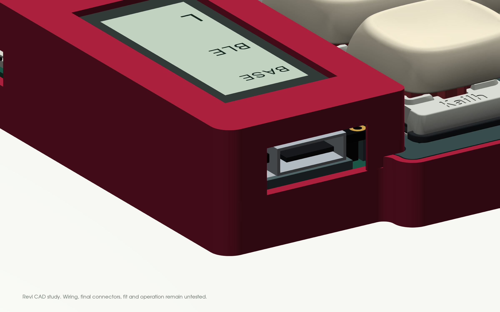
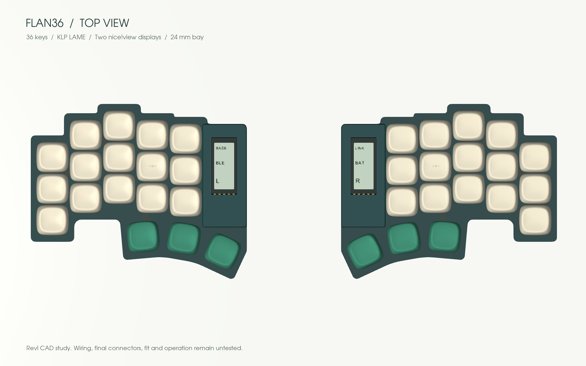
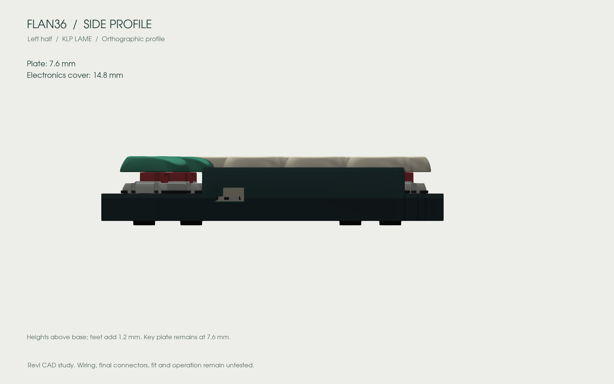
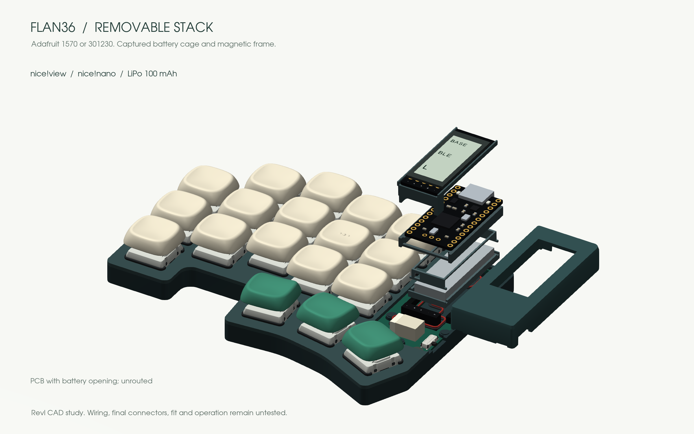

# Design

Keep Piantor’s angles, a thin key area and serviceable electronics.

| Choice | Reason |
|---|---|
| 3 × 5 + 3 keys per half | Remove the unused outer column without changing the remaining centers or angles |
| Choc v1 hot-swap | Low-profile, replaceable switches |
| Two nice!nano controllers, intended ZMK firmware | Wireless halves and host connection; USB-C for charging/programming |
| Battery below controller, display above | Concentrate electronics in the existing 24 mm bay |
| Independent internal supports | Neither the battery pouch nor display glass carries the stack |
| Interchangeable opaque display frames | Hide the stack and customize its appearance without moving keys |

## The stack

The insulating saddle stays below the PCB. The cell and a narrow removable cage pass through a **12.5 × 34.4 mm opening with a local rear lead notch**. One cavity accepts the nominal Adafruit 1570 and 301230 envelopes; select either in the viewer or FreeCAD. Each battery profile has two continuous nominal 105 mm lead paths with its own cell-end transition. Supplier terminal positions, wire diameter and strain relief still need measurement. [Battery dimensions and sources](parts.md#battery).

The case is **116.75 × 94.57 mm per half**. Five stepped column tops, an orthogonal pinky foot and a shallow rounded recess follow the reference. Straight lower faces remain parallel to each thumb key, joined by **local tangent arcs**. The outside thumb flank stops at the LCD panel edge. The 21 control corners use locally bounded radii, including R2.4 finger corners where space permits. Checked exposed faces retain a **4.75 mm** margin from the switch opening to the plate edge. Fasteners stay within existing material. Both halves are exact mirrors; all 36 switch centers and angles remain unchanged.

Choose [Solid, Color rim or Terrace](cases.md). These are different base/plate geometries, compatible with the same stack and ten display frames. The printed display cover can be omitted while retaining the display and structural supports.

The key plate stays at **7.6 mm**. Plain and decorated frames share one roof height, with no raised decoration. See [current stack dimensions](slim-flush.md). The electronics bay remains **24 mm wide**; illustrative feet add 1.2 mm. The frame ends at Y=67 mm while the low base/plate continue to the thumb. The power-switch reference is now recessed 0.1 mm inside the straight X=135 mm flank.

The frame now shares the case's **R2.4 north/outside corner** beside USB, including its tangency points. The former independent R1.2 frame corner projected about **0.497 mm** beyond that curve. The cavity, plate clearance and beveled lips follow the corrected corner; the case and PCB outlines stay unchanged.

### Can the stack be thinner?

The [slim, flush redesign](slim-flush.md) lowers the display and replaces the tall generic battery-connector reserve with a dimensioned side-entry JST PH pair. It also reroutes the leads and moves reset to a recessed underside access.

All decorative colors finish at the same roof height. The selected KLP Lamé caps still reach **17.87 mm**, excluding feet; this update lowers the electronics enclosure rather than the keycap tops. Exact connector engagement, printed fits and real cable behavior remain to be measured.

The [historical support study](slim-mount-study.md) retains its original rejected candidates. Integrating washers or saddles reduces loose parts but gave **zero height reduction**. The current design keeps these supports independently replaceable.

### Magnetic frame, independent structure

Three captive **Ø2 × 3 mm magnets** in the base attract three captive **Ø2 × 4 mm steel pins** in each frame. Shallow guides locate the cover; it lifts vertically. The frame carries no battery or display load. Five internal M2 fasteners per half retain the plate/PCB independently, with no added perimeter lobes. Three use 6 mm shafts; the two hidden under the frame use 4 mm shafts.

The inserts are enclosed by a pause-and-insert print sequence. Force through the nominal **0.9 mm gap**, north-edge peel, print capture and magnet temperature remain physical tests. [Assembly sequence and coupons](build.md#magnetic-frame-and-service).

## One or two displays

The CAD shows two nice!view displays; one on the left remains the fallback if integration becomes impractical. The intended central display shows primary keyboard state. A peripheral display may show its own battery/link state; mirrored layer information is not promised. [nice!view setup](https://nicekeyboards.com/docs/nice-view/getting-started/).

nice!view is a reflective memory LCD. OLED improves dark-room visibility but uses more power; e-paper favors mostly static images and needs different mounting and firmware. These are alternatives to redesign around, not drop-in replacements. [Display specifications](https://nicekeyboards.com/docs/nice-view/).

## Modularity

Switch sockets, removable controller/display connectors, a battery connector, magnetic covers and independent screws allow servicing after initial soldering. The frames are separate from the display support. Service electronics with power off and USB disconnected; removable connectors are not a proposal for live module hot-plugging.

## CAD views

These views come from the exported geometry. Electronics, switch bodies, keycap seating, screws and feet are nominal references. No physical assembly or functioning keyboard is established by the renders. [Source files and remaining work](cad.md).
