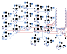
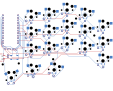

# Routed electronics

Both revI boards are now routed. KiCad 10.0.6 reports **0 DRC violations, 0 unconnected items, 0 schematic parity issues and 0 ERC violations** on each serialized board and schematic. All 247 physical pads per half were checked, including duplicate pad numbers in the hot-swap footprints.

These are prototype candidates. Exact connectors, supplied cell fit, printed retention, radio performance and electrical operation remain untested. Use the [parts guide](parts.md), [assembly sequence](build.md) and [firmware](firmware.md) together.

| Half | Editable project | Prototype Gerbers and drills |
|---|---|---|
| Left | [KiCad project](../hardware/revI/flan36-left.kicad_pro) | [Left ZIP](../hardware/revI/fabrication/flan36-left-revI-prototype.zip) |
| Right | [KiCad project](../hardware/revI/flan36-right.kicad_pro) | [Right ZIP](../hardware/revI/fabrication/flan36-right-revI-prototype.zip) |

Download the repository to retain the relative libraries and 3D models. In KiCad, open the project, then PCB Editor; use **Alt+3** for the assembly view. The [FreeCAD workflow](freecad.md) remains the editable mechanical source.




## Fabrication candidate

- Two copper layers; **1.6 mm FR4**, nominal **1 oz copper**.
- Minimum routed track **0.20 mm**; netclass clearance **0.20 mm**; copper-to-edge **0.50 mm**.
- ZIPs include both copper, mask and silkscreen layers, Edge.Cuts, separate plated/non-plated drills, drill maps, source hashes and a prototype notice. Internal battery/station openings belong to Edge.Cuts.
- Inspect the fabricator's Gerber and drill preview, including internal cutouts and the narrow north bridge. No panelization or assembly service is specified here.

The exact original key angles, all footprint/pad geometry, holes, model references and outer/internal contours were preserved against `fe8c7fd`. The FreeCAD case did not change. The router's sub-micron coordinate rounding was restored before the final checks.

The right MCU uses different GPIOs so signals can escape toward the keys. Its rows use **D21/D20/D19/D18**, and column 0 uses **D15**. The left keeps D2/D3/D4/D5 and D6. All other columns and display pins are unchanged. The same [pin map](../design/pinmap.json) is checked against schematic, every PCB pad and compiled firmware. Do not flash the left file onto the right board.

## Power and assembly checks

Before installing controllers, check BAT+ to GND for shorts and verify J1 polarity against the supplied pack. J1 pin 1 is BAT+; pin 2 is GND. SW1 connects BAT+ to the controller's RAW/B+ input. Opening SW1 disconnects the cell, including from charging; USB can still power the controller. Reset connects RST to GND.

Keep the nice!nano **BOOST jumper open**. The Adafruit reference allows at most 100 mA charging; obtain the actual 301230 pack's permitted charge rate before using that alternative. A matching pouch dimension does not establish charging compatibility.

Check diode cathodes toward row nets, socket solder joints and every key before installing the case. The pin map and zero ERC result do not prove the actual modules, charging, BLE, sleep current or display wake work. Record those observations in the [hardware acceptance checklist](build.md#hardware-acceptance).

## Reproduce the checks and exports

Run from the repository root with KiCad 10.0.6 and its Python module. On macOS:

```sh
KICAD_PY=/Applications/KiCad/KiCad.app/Contents/Frameworks/Python.framework/Versions/Current/bin/python3
"$KICAD_PY" tools/check_routed_pcb.py
python3 tools/export_fabrication.py
python3 tools/check_layout.py
```

On other systems, use a Python runtime that can import `pcbnew`, and pass `--cli /path/to/kicad-cli` when needed. The geometry comparison needs the baseline commit in local Git history; use a full clone. The checker rejects unrouted boards, altered geometry, mismatched physical pads and failed DRC/ERC/parity. It writes [routing evidence](../validation/revI-routing.json); the exporter refuses stale evidence and records [package hashes](../validation/revI-fabrication.json).

`build/routing-validation/` and `build/fabrication/` are ignored, reproducible outputs of these commands. Export timestamps can differ; the receipt identifies the actual generated bytes. The editable routed KiCad boards are the source for future edits. The earlier `prepare_routing.py`, `remap_right_mcu.py` and `complete_pcb_routes.py` are migration helpers, not required to rebuild the fabrication package. Do not run an old placement generator over routed work.

The routing history used Freerouting 2.4.1 with internal cutout routing reserves, followed by local clearance repair and independent KiCad checks. Approval and bounds are recorded in the [build continuation](reviews/2026-10-08-build-continuation.md).
