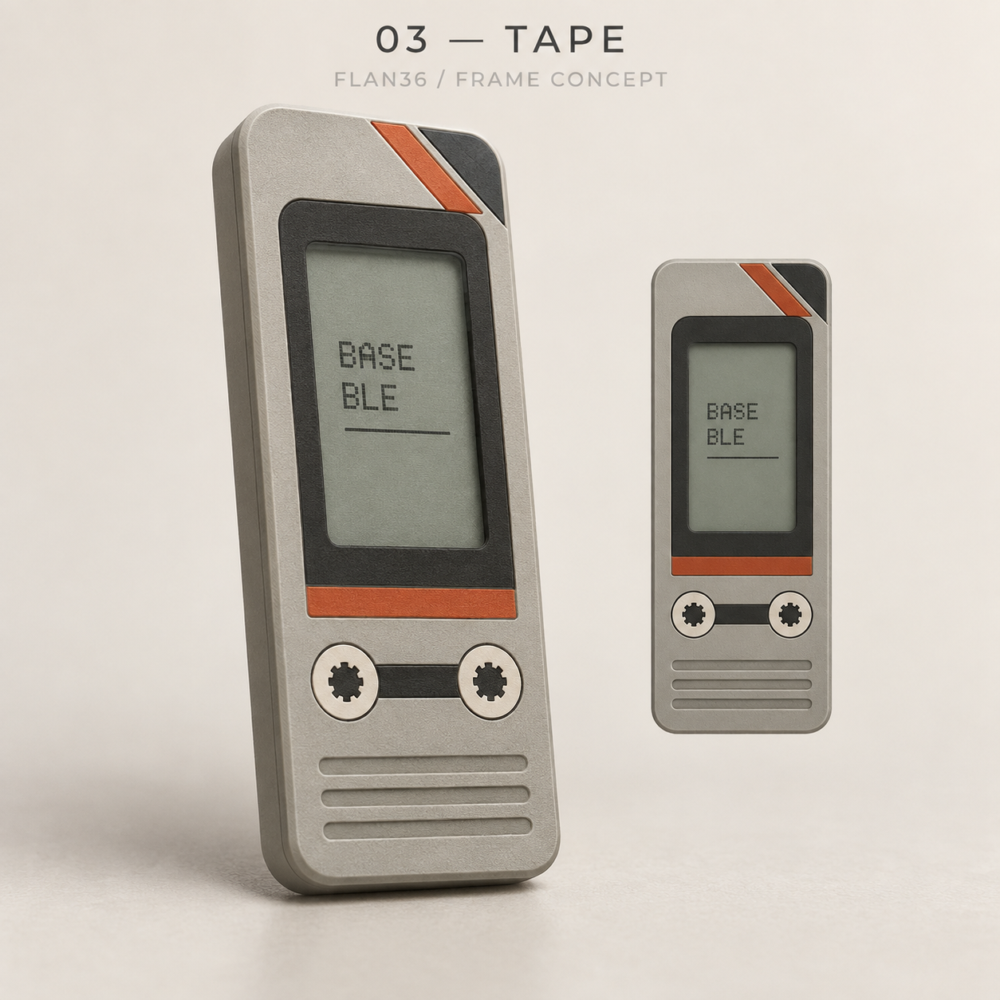
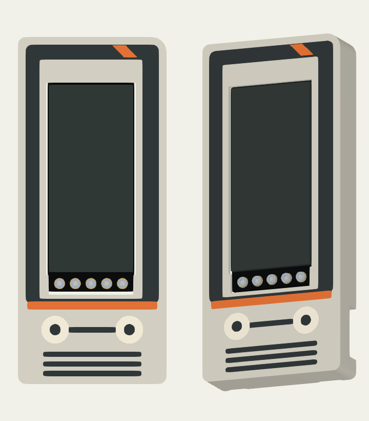
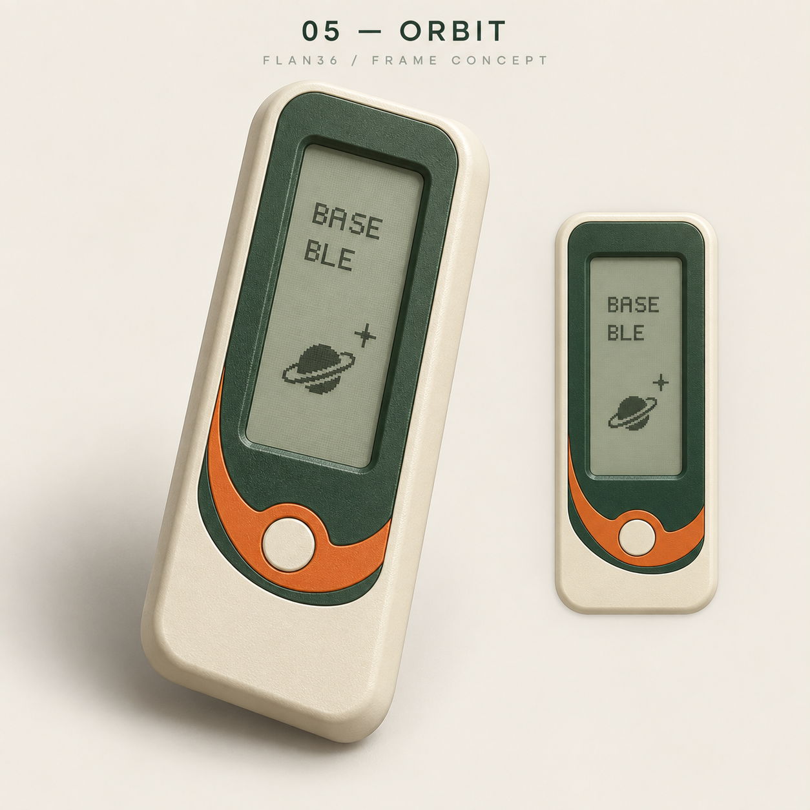
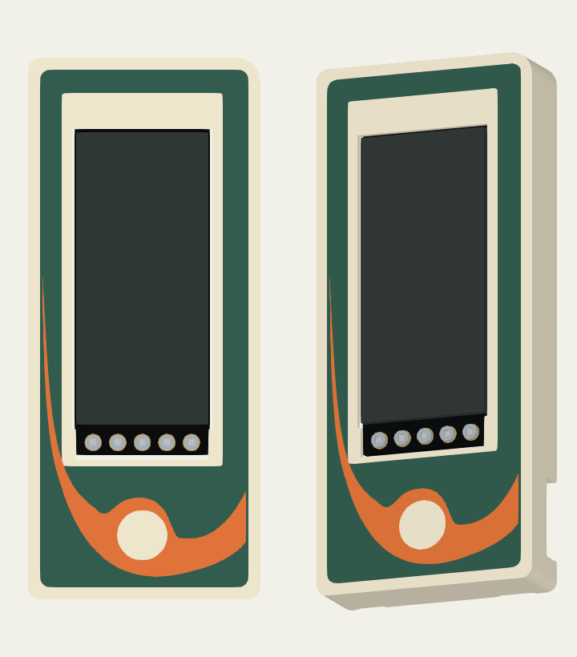
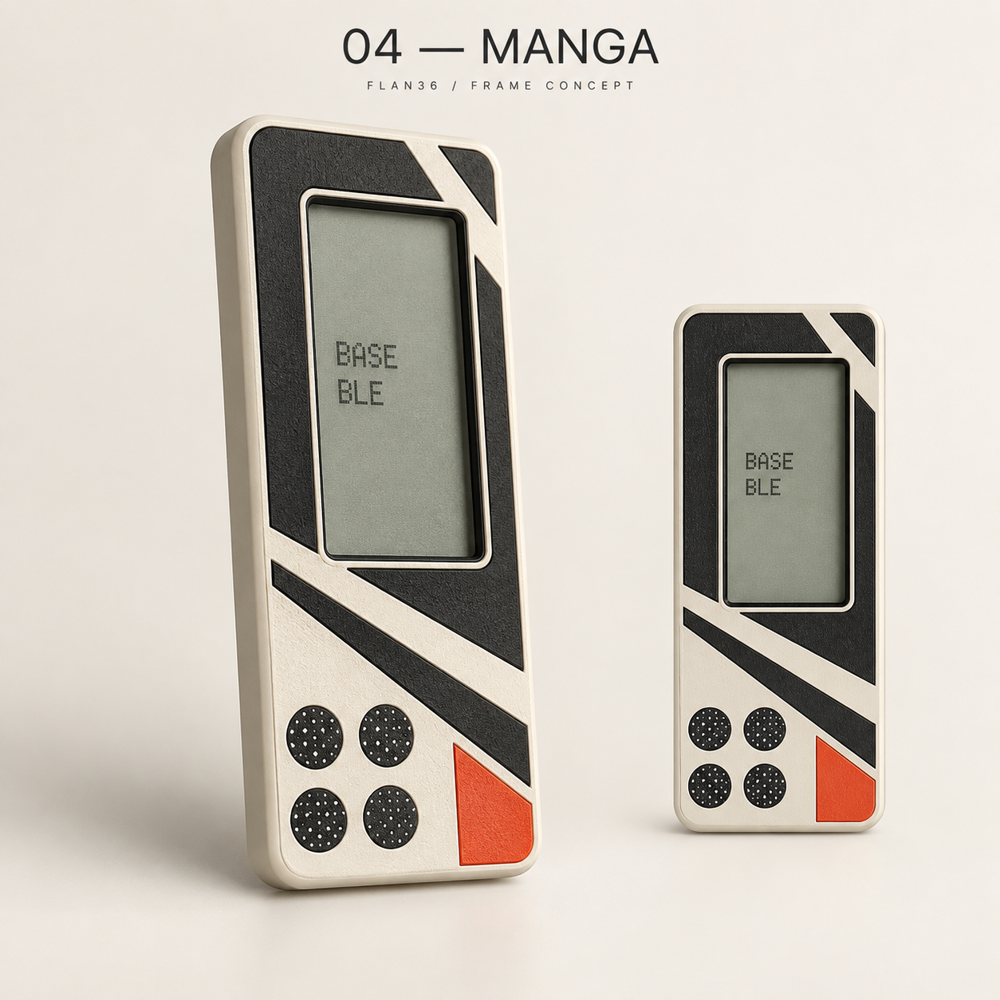
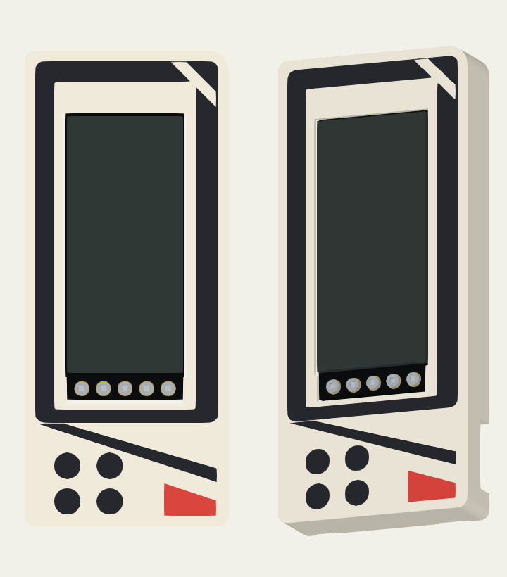
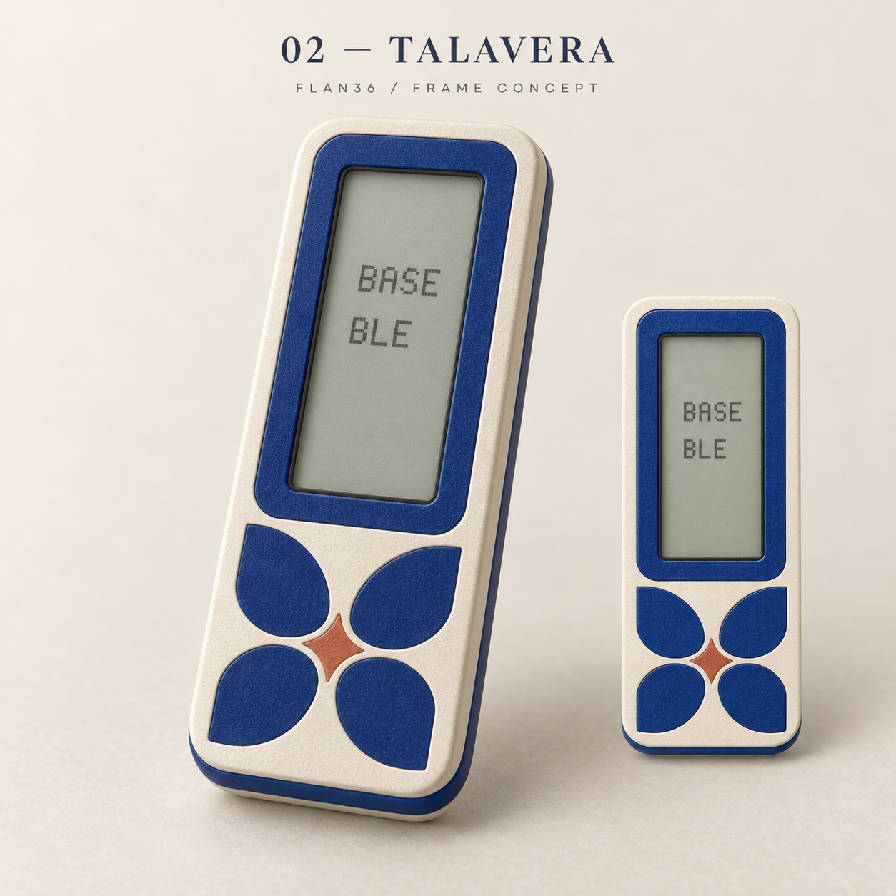
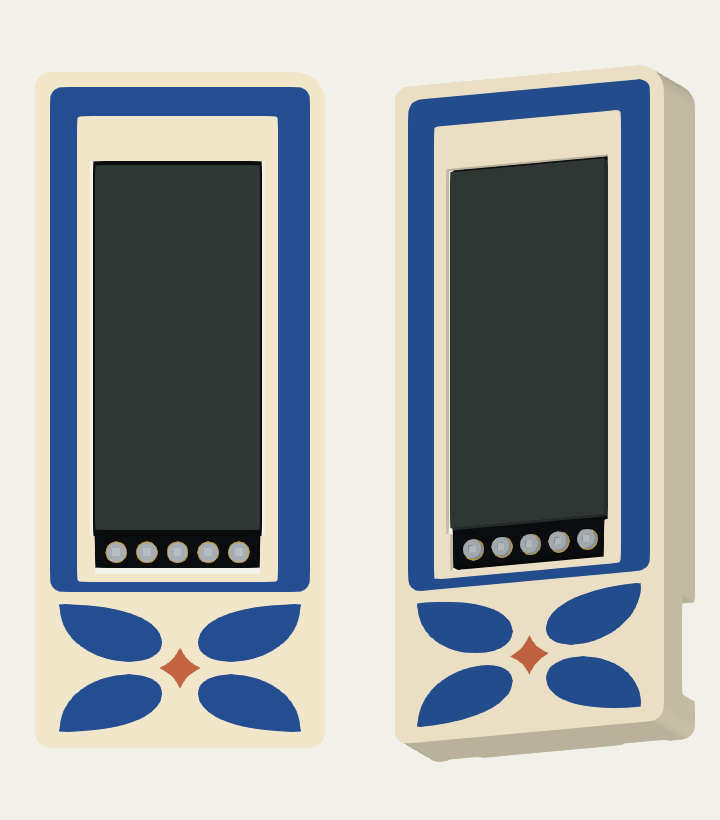

# Frame reference comparison

**Historical concept comparison.** Talavera now follows the approved dimensioned R4 master; Tape, Orbit and Manga were subsequently removed from the active collection. See the [current collection](frames-extra.md).

Original concepts and orthographic/oblique views from the actual native material parts. The compositions use solid-color flush regions. The real display opening and connector access determine the usable space; they are shown, not covered in the render.

| Selected concept | Actual CAD |
|---|---|
|  |  |
|  |  |
|  |  |
|  |  |

The concepts were generated for this project on 2026-09-28. They are visual references, not dimensioned hardware drawings. Native proportions accommodate the existing nice!view glass, header and backed roof.

Regenerate these views after adopting a validated native export:

```sh
/Applications/FreeCAD.app/Contents/Resources/bin/python tools/render_frame_details.py
/Applications/FreeCAD.app/Contents/Resources/bin/python tools/render_frames.py
```

On other platforms, use a Python environment with VTK. The renders use the exported material solids and the real display model, not the concept images.
