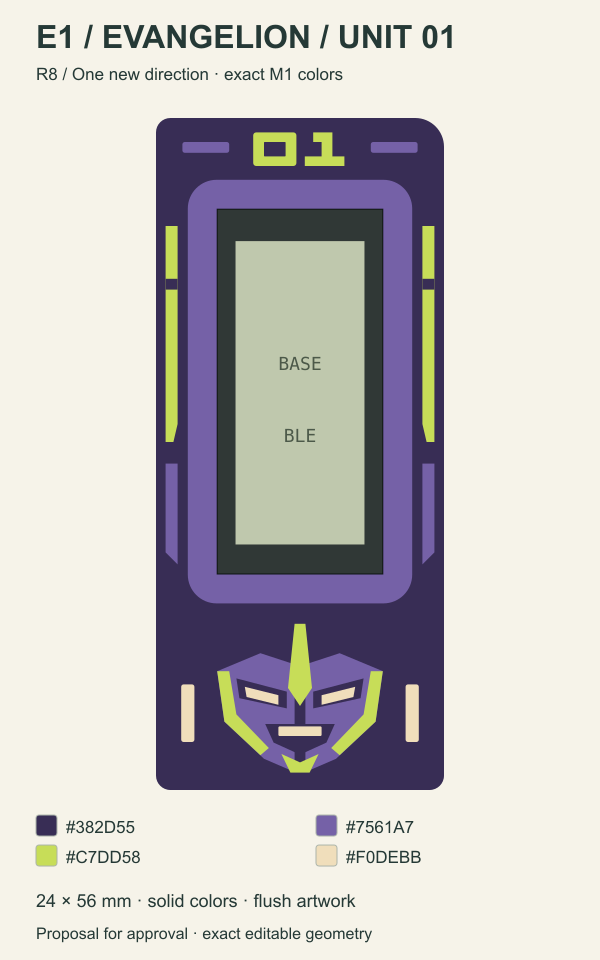

# Selected frames + Evangelion

[Open the mobile gallery](https://eduarbo.github.io/flan36/frame-proposals/).

**Talavera, Game Boy, SNES, Phone, iPod and Hanafuda stay.** Their exact artwork and palettes are unchanged. All six Mecha and Kumiko proposals from R7 were rejected and are excluded from the current selection.

## One new proposal

**E1 / Evangelion Unit 01** uses the four exact M1 colors: `#382D55`, `#7561A7`, `#C7DD58`, `#F0DEBB`. A single horn, angular helmet, flat shoulder markings and a geometric 01 identifier replace the rejected scout artwork. Details remain flush; no gradients or raised decoration.

[Dimensions](frame-proposals/r8/evangelion-dimensioned.png) · [Native 3D view](frame-proposals/r8/native-review.png) · [FreeCAD review](../design/proposals/frame-redesign-r8/Artwork-R8.FCStd) · [Exact master](../design/proposals/frame-redesign-r8/master.json)

The current 24 × 56 mm blank, 2.40 mm bezel, 13.90 × 30.50 mm opening and Z13.59 mm face remain unchanged. The drawing and native solids use the same paths and HEX values. The 0.4 mm nozzle / 0.2 mm layer target still requires slicing and a sample print.

Evangelion awaits artwork approval. Hanafuda is selected and awaits integration; the other five selected designs are already in the current assembly. This round changes the selection gallery, not the production assembly or main explorer. [Selection record](../design/proposals/frame-redesign-r8/scope.json).

Original fan-art interpretation, using the [licensed Unit-01 model](https://www.goodsmile.com/en/product/59101/MODEROID%2BEvangelion%2BUnit-01) as a character reference. No commercial artwork was traced.
