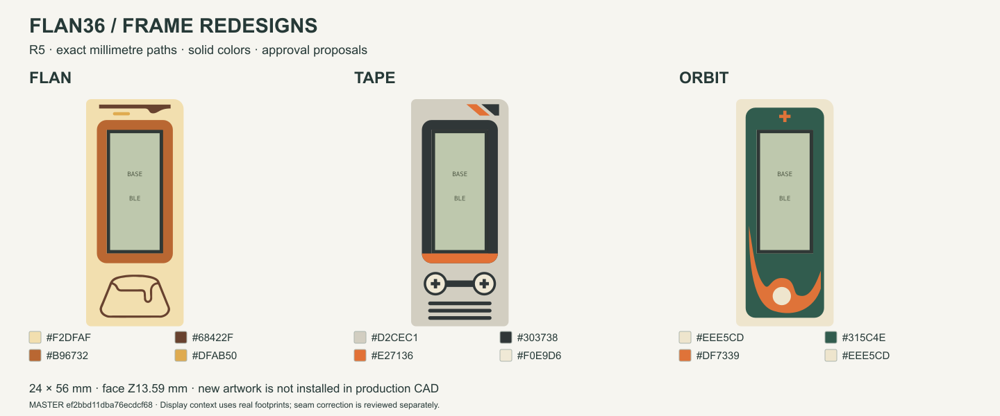
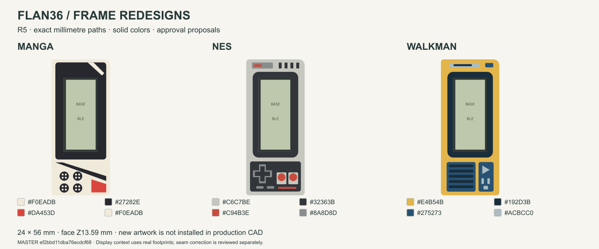
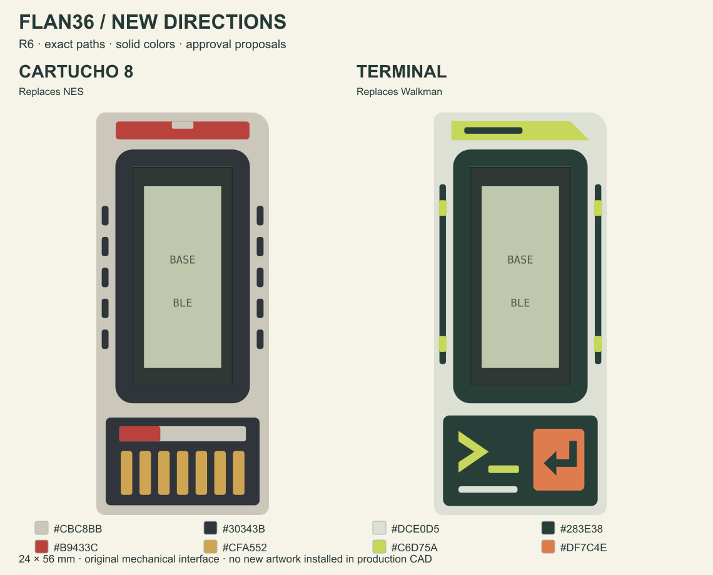

# Six new frame directions

[Open the mobile gallery](https://eduarbo.github.io/flan36/frame-proposals/) to compare **Caramelo, Lucha, Hanafuda, Mecha, Cartucho 8 and Terminal**. Tap any frame for a larger image or its dimensions. R5 was rejected; these R6 proposals await approval before integration.

All six use the existing **24 × 56 mm** mechanical blank. Their **solid HEX colors and flush shapes** come from one [millimetre master](../design/proposals/frame-redesign-r6/master.json), shared by the SVGs, dimensioned sheets and [editable FreeCAD review](../design/proposals/frame-redesign-r6/Artwork-R6.FCStd). Open the document's six labeled groups to inspect or hide candidates and their material solids.

The [native render](frame-proposals/native-review.png) uses the actual review solids. The [geometry check](../design/proposals/frame-redesign-r6/geometry-check.json) verifies clipping, disjoint closed material volumes, exact top surfaces, save/reopen and clearance to the existing display. These are review artifacts; thin tips, color bonding, toolpath retention and printed fit still require a sliced sample with the **0.4 mm nozzle / 0.2 mm layer** target.

The current assembly, corrected opening, stack height, themes and viewer remain unchanged. The [rejected R5 files](../design/proposals/frame-redesign-r5/) are preserved as history.
