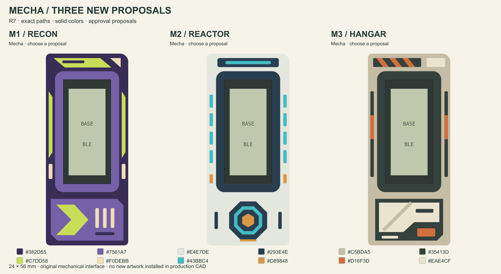
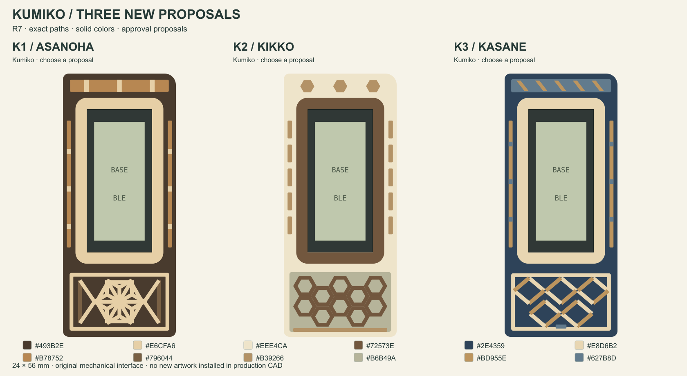

# Hanafuda, Mecha and Kumiko

[Open the mobile gallery](https://eduarbo.github.io/flan36/frame-proposals/). **Hanafuda is retained unchanged.** Choose one of three new Mecha directions and one of three Kumiko directions before artwork integration.

- **M1 / Recon:** purple scout armor and lime directional panels.
- **M2 / Reactor:** pale armor, cyan reactor ring and amber core.
- **M3 / Hangar:** sand-colored service armor and an offset access hatch.
- **K1 / Asanoha:** warm wood tones and a sixfold leaf lattice.
- **K2 / Kikko:** repeating walnut-colored hexagons on a pale base.
- **K3 / Kasane:** an original indigo and wood-toned diagonal lattice.

All share the current **24 × 56 mm** blank, a **2.40 mm** screen bezel and flush details. Their [millimetre master](../design/proposals/frame-redesign-r7/master.json), 1:1 SVGs and [FreeCAD review](../design/proposals/frame-redesign-r7/Artwork-R7.FCStd) use identical paths and HEX colors. The [native render](frame-proposals/r7/native-review.png) comes from those review solids.

Kumiko is represented by colored inlays, not open wood joinery. Nominal lattice strips are 0.80–0.85 mm wide; the 0.4 mm nozzle / 0.2 mm layer target, intersections and printed fit still need a sliced sample. Pattern vocabulary: [Tanihata](https://kumikowoodworking.com/products/category/auspicious-omens-motifs/), [Shion Kumiko](https://www.shion-kumiko.com/order-guide/kumiko-patterns/).

Caramelo, Lucha, Cartucho 8 and Terminal are excluded from the active selection. Their [historical R6 files](../design/proposals/frame-redesign-r6/) remain available. The current assembly and main viewer have not been changed in this proposal round.
