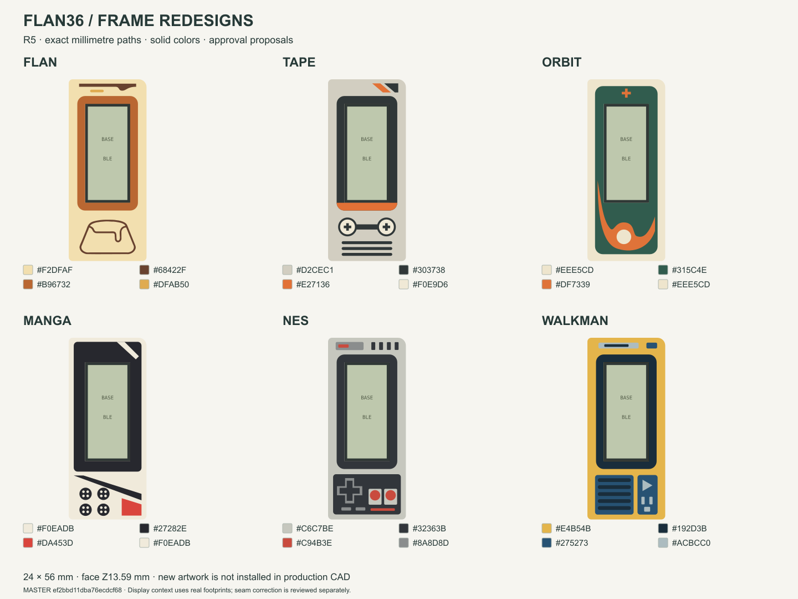

# Six frame proposals

[Open the mobile gallery](https://eduarbo.github.io/flan36/frame-proposals/) to compare **Flan, Tape, Orbit, Manga, NES and Walkman**. These are new approval proposals; their artwork has not replaced the six existing designs in the explorer.

All six use a **24 × 56 mm** envelope, solid HEX colors and flush details. The gallery, [1:1 SVGs and master](../design/proposals/frame-redesign-r5/), and [FreeCAD review](../design/proposals/frame-redesign-r5/Artwork-R5.FCStd) share the same millimetre paths. The [native render](frame-proposals/native-review.png) comes from the review solids. The LCD fill in the cards is illustrative; it does not conceal gaps around the actual glass footprint.

The corrected opening is **13.90 × 30.50 mm**, with **0.10 mm nominal glass clearance** on all four sides. Face height remains **Z13.59 mm**. Thin details, printed fit and the 0.4 mm nozzle / 0.2 mm layer target still require slicing and a physical sample.

The [geometry receipt](../design/proposals/frame-redesign-r5/geometry-check.json) checks clipping, material partitions, closed review solids, save/reopen and exact agreement between the planar source and top surfaces. Approval applies to these curves and palettes, not a later reinterpretation of a picture.
