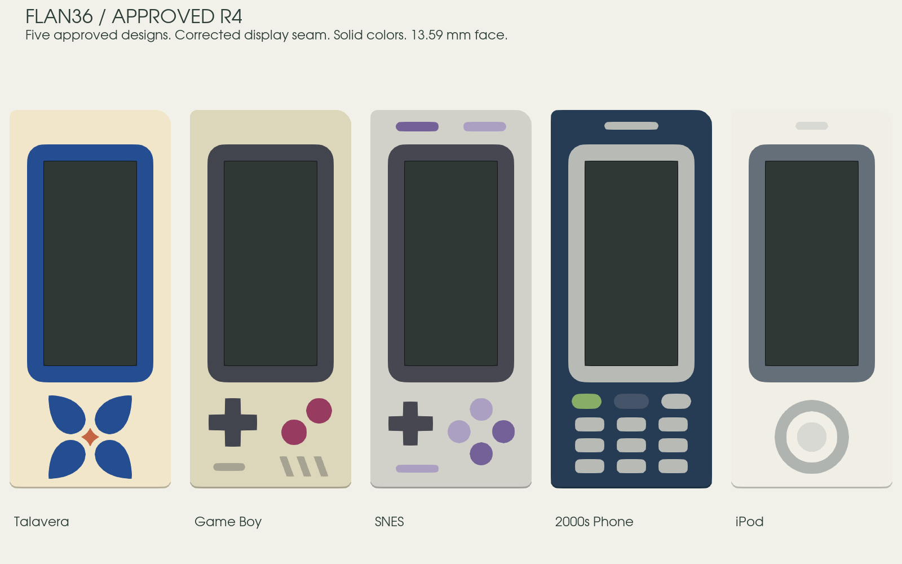

# Frame collection

Choose **Frame** in the [3D explorer](https://eduarbo.github.io/flan36/) and click a preview. Each thumbnail uses the actual native material geometry. **Talavera** is the default; switching designs preserves the camera, colors and other selections.



| Approved R4 design | Motif |
|---|---|
| **Talavera** | Uniform cobalt bezel, four curved petals and a terracotta star. |
| **Game Boy** | Pocket-console bezel, cross pad and berry buttons. |
| **SNES** | Soft gray console and lavender controls. |
| **2000s Phone** | Navy faceplate, silver keypad and call key. |
| **iPod** | White face, silver click wheel and continuous screen border. |

**The selected collection is Talavera, Game Boy, SNES, Phone, iPod and Hanafuda.** Hanafuda retains its R6 artwork and awaits integration. [The current gallery](frame-proposals.md) contains only these six approved designs; no new proposals await approval. The main explorer and print kit include only the five installed approved designs. Flan, Tape, Orbit, Manga, NES and Walkman are retired; saved files substitute Talavera while preserving colors and other choices.

All designs use solid colors, without gradients or raised details. **Restore design colors** applies the exact palette. HEX editing and coordinated case/key themes remain available.

## Shared dimensions

| Feature | Dimension |
|---|---:|
| Frame face / Level upper shell | Z13.59 mm |
| Display glass | Z13.39 mm; recessed 0.20 mm |
| Pin cover | 0.40 mm; underside Z13.19 mm |
| Nominal solder clearance | 0.20 mm |
| Glass opening | 13.90 × 30.50 mm; 0.10 mm nominal glass clearance |
| Approved bezel width | 2.40 mm, exact outward offset |
| Ordinary inlay / remaining backing | 0.40 / 1.00 mm |
| Thin display collar | 0.865 mm through-color volume |

R4 centered the complete display chain by +0.20 mm X on the left and −0.20 mm on the right, including contacts, guides, native PCB drills and KiCad J2. The subsequent [seam correction](../design/display-seam-implementation.md) closes the exposed side bands and centers the opening vertically. It adds no further display translation or height. Key centers, MCU, battery and mounting datums stay fixed. Heights start at the case underside, excluding feet.

## Exact artwork to printable geometry

The approved [R4 master](../design/proposals/frame-master-r4/master.json) owns palettes, circular arcs, Bézier curves and painter order. The [seam-only delta](../design/proposals/display-seam-r1/master.json) updates the opening and uniform screen bezel. The [native builder](../tools/freecad/approved_frames.py) chooses the recorded master for each document and checks each material's top face on both halves, closed volumes, separation and thickness domains. No artwork is traced or clipped to an older support mask.

Download **Files → Print kit** for registered multipart 3MF and STL files. STEP material bodies and the editable [FreeCAD assembly](../mechanical/revI/Flan36.FCStd) share the same coordinates. These are co-print regions, not press-fit inserts. Assign compatible filament to each role, keeping the assembly registered. [Print workflow](themes-printing.md).

The 0.40 mm cover targets a standard 0.4 mm nozzle workflow. Thickness and digital collision checks do not prove sliced feature retention, bridging, strength or physical fit. Inspect the toolpaths and print a sample; the PCB studies remain unrouted.

## Reproduce the approved migration

For the current assembly, follow the [seam correction commands](../design/display-seam-implementation.md#reproduce). The commands below reproduce the earlier R4 snapshot. Use the preserved pre-R4 native file from commit `2de168b54146c2b135a6438bb1d6a5b30bcc0141` as the input, in an ignored build directory. Keep the approved master unchanged.

```sh
mkdir -p build/approved-r4/source
git show 2de168b54146c2b135a6438bb1d6a5b30bcc0141:mechanical/revI/Flan36.FCStd > build/approved-r4/source/Flan36.FCStd
python3 tools/freecad/run_macos.py tools/freecad/install_approved_frames.py \
  --source build/approved-r4/source/Flan36.FCStd \
  --output build/approved-r4/reproduced/Flan36.FCStd
FLAN36_EXPORT_OUT=build/approved-r4/reproduced \
FLAN36_EXPORT_METADATA=build/approved-r4/reproduced/revI.json \
FLAN36_EXPORT_REPORT=build/approved-r4/reproduced/mechanical.json \
python3 tools/freecad/run_macos.py tools/freecad/export_revI.py
python3 tools/freecad/run_macos.py tools/freecad/check_approved_frames.py \
  --source build/approved-r4/reproduced/Flan36.FCStd \
  --report build/approved-r4/reproduced/geometry.json
```

The installers preserve their inputs, saved configuration, caps and deferred artwork, then save and reopen the candidate. The exporter checks every frame, case and battery variant. [Current installation](../validation/revI-display-seam-native.json) · [Current export checks](../validation/revI-mechanical.json) · [Delivery binding](../validation/revI-approved-frames.json) · [Seam review](../validation/revI-display-seam-review.json) · [Historical seam public readback](../validation/revI-display-seam-public.json). The [R4 installation](../validation/revI-approved-frames-native.json) and [R4 public readback](../validation/revI-approved-frames-public.json) remain historical evidence.

Render the five-design sheet with `python tools/render_frames.py --approved-only --output docs/images/revI-approved-r4.png --report validation/revI-approved-frames-render.json`; the default render command produces the full eleven-design gallery. Run `node viewer/frame-collection-check.cjs` to verify the rebuilt active viewer and its ten registered frame assemblies. The earlier `check_approved_3mf.py` and `check_approved_frames.py` delivery scripts bind the historical eleven-design snapshot, not this filtered viewer. [Selection correction and checks](../design/approved-viewer-selection.md). The browser check needs Playwright and Chromium, as described in the [CAD guide](cad.md).

Earlier collection installers and receipts describe older snapshots. Do not run the old artwork generator over the approved master. Ignored `build/approved-r4/` contains reproducible candidates, logs and test output from the commands above; final evidence lives in `validation/`.
