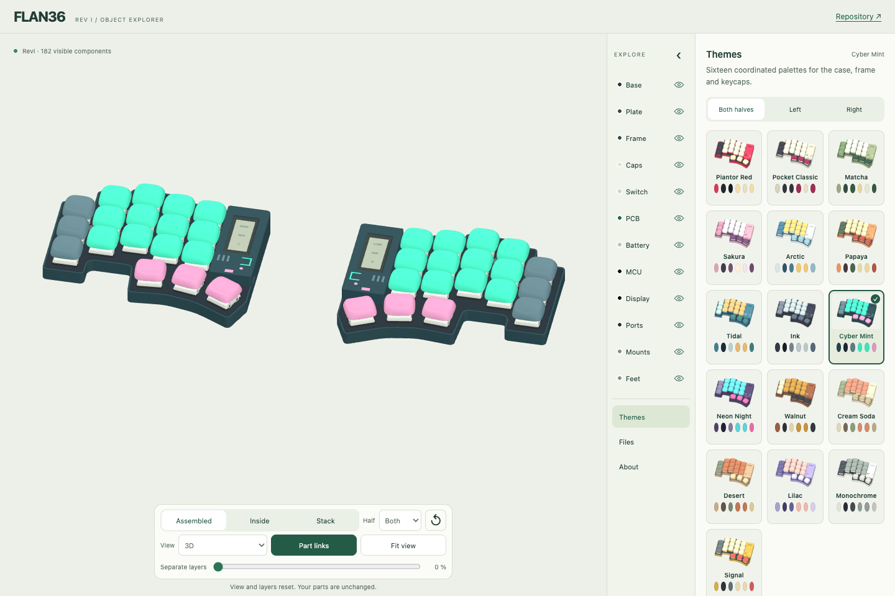

# Make it yours

Open [the 3D explorer](https://eduarbo.github.io/flan36/), choose **Themes**, and pick a starting palette. Sixteen presets coordinate the case, frame and keycaps. Their previews use your selected shapes.

1. Choose **Both halves**, **Left** or **Right**.
2. Pick a theme. It changes colors while preserving shapes, keycap geometry and installed covers.
3. In **Base**, edit the base/rim and key plate. In **Frame**, edit the body and flush inlays. Every color also has a HEX field and **Copy** button.
4. Enable **Match frame and rim** for continuous color. Editing either linked color updates the other.
5. Use **Files → Download print kit** for the selected parts.

Handheld, Retro TV, Cyberpunk, Cartridge, Arcade, Mecha and Kintsugi have four color regions. Smooth, Bevel and Facet use a single body color. Original design palettes remain available through **Restore design colors**.

Changing shapes preserves customized colors. An untouched original design adopts the new shape's original palette. Switching a frame reinstalls its cover; applying a color theme does not.

## Keep your configuration

Selections save automatically on this device. **Save configuration** downloads JSON for another browser or the FreeCAD configuration macro. JSON carries explicit colors, shapes and cover installation, so a preset name never changes an old saved design. Legacy JSON still loads.

Eye, Solo, camera and exploded views are inspection controls. They do not remove parts from the print kit. Unchecking **Printed display cover** does remove that cover and its targets from the selected assembly.

## Printable parts and joining

**Shells** exports each selected case, key plate and installed frame. **Complete printed set** also includes the battery saddle, cage, controller support, display support and three printed washers per half. Commercial parts and KLP keycaps are excluded; [keycap sources and fit guidance](customize.md#klp-lamé) remain separate.

The [support study](slim-mount-study.md) includes experimental plates with integrated washers and optional bases with integrated saddles. These reduce loose parts, not height, and are downloaded separately from the reference print kit.

- The structural case uses three M2 × 6 and two M2 × 4 screws per half. Tap the 1.7 mm pilot holes to M2.
- Each installed frame uses three captive Ø2 × 3 mm magnets and three Ø2 × 4 mm ferromagnetic pins.
- Cavities, guides and screw holes belong to the CAD geometry. Plan insertion pauses for captive hardware before slicing.
- There is no clip variant yet. A color or theme does not change the joining method.

The ZIP includes the selected geometry, JSON and a manifest with quantities, source hashes, units, colors and joining details. STL coordinates are the unchanged native assembly coordinates, in millimetres. Prepare orientation, supports, tolerances and your actual filament in the slicer.

This is prototype geometry. Print [fit coupons](cases.md) before a complete set. Neither magnets, tapped threads nor the whole assembly have physical acceptance yet.

## Color 3MF status

Decorated frames export as **multipart 3MF assemblies**: one recessed shell and separate closed volumes for the three inlay colors. All parts share one transform, so the inlays stay registered to their pockets. They occupy the upper **0.4 mm** and finish at the same height as the roof, leaving at least **0.8 mm** of backing in the checked model.

These are complementary volumes for **co-printing**, not separately printed press-fit inserts. Use compatible colors of the same material and qualify their bonding on a small sample. The kit also includes the original aligned material STLs and a fused single-material STL. The fused file has a plain surface and cannot reproduce the color pattern by geometry alone.

The generic files contain no printer or process profile. The manifest records the common bed translation, colors, material roles and source hashes.

**Check the filament assignments in Bambu Studio.** Map **body, detail, accent and secondary** to the manifest colors and keep the material volumes together as one multipart object. Automatic palette assignment and slicer GUI save/reopen remain unverified. Inspect the sliced inlay layers before printing.

Keycaps are included in global themes. For independent colors, row/column patterns and portable personal palettes, use [Caps → Colors](customize.md#keycap-colors). Selecting another keycap shape preserves its assigned color.
